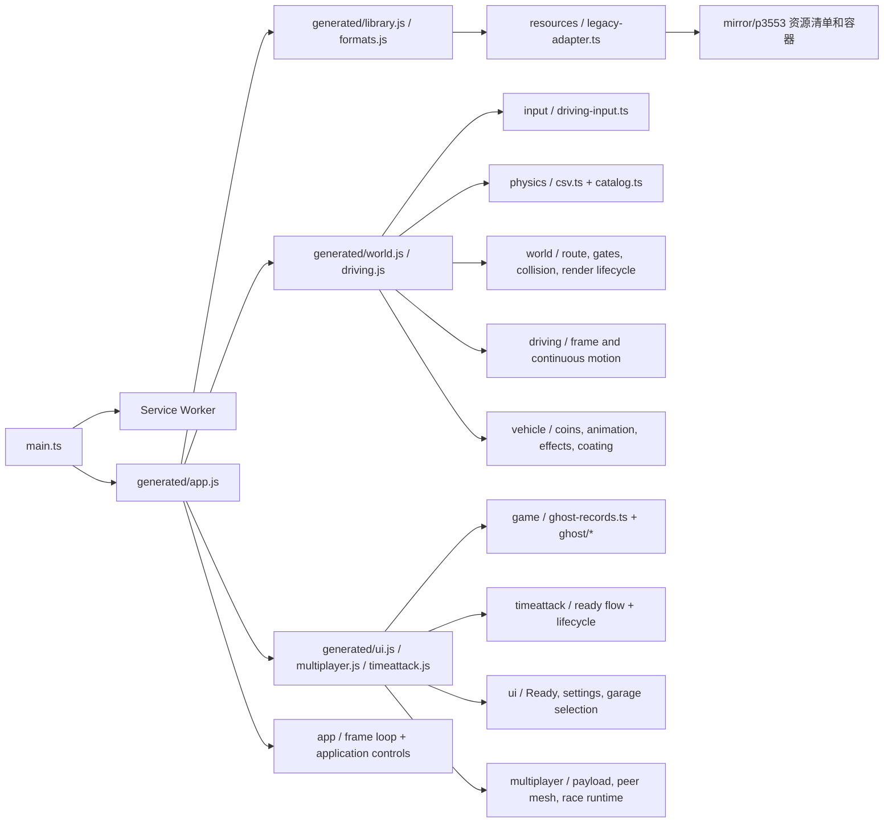

# 开发架构与迁移边界

发行版是一个经 Rollup 合并的浏览器模块和一个懒加载车库模块。`tools/generate-modules.mjs` 按顶层声明和跨模块引用，把前者拆成可导入的模块；这些模块负责维持还没有手写迁移的行为。生成文件可阅读和搜索，但保留了发行包压缩后的标识符。手写 TypeScript 模块位于 `src/` 的其他目录。

`src/game/api.ts` 对主要兼容类给出稳定的语义名称，应用实际启动仍由 `src/main.ts` 控制。`src/generated/manifest.json` 记录固定输入哈希、生成文件、跨模块依赖和已启用的手写替换。不要在生成目录里修补业务逻辑；重新生成会覆盖改动。

## 模块职责

| 生成模块 | 当前职责 | 手写迁移入口 |
| --- | --- | --- |
| `vendor.js` | Three.js 和其他发行版运行依赖 | 驾驶输入声明已换成 `src/input/` |
| `formats.js` | 场景及容器二进制格式 | `src/codecs/` 的 Rho/Rho5 索引扫描、解码和挂载已接入 `Sw.load` |
| `library.js` | 虚拟资源库、路径查询和资源索引 | `src/resources/` 与 `src/codecs/sw-compat.ts` 已接管 `Sw` 的 38 个方法，包括档案载入、目录、查询、车辆身份及配置；模块内其他辅助仍有兼容代码 |
| `data.js` | 车辆 CSV 与覆盖数据入口 | 现只转发 `src/physics/release-data.ts`；可编辑 CSV/JSON 在 `src/physics/data/`，提取脚本和差分测试保留原版数值、顺序及共享引用 |
| `vehicle.js` | 参数组合、车辆配置与部分效果 | `src/physics/` 已替换参数表与车型查询；`src/vehicle/` 已接入金币、人物动作、充能特效、车膜与悬挂饰品运动，部分模型/特效底层仍在兼容层 |
| `driving.js` | 车辆模拟 | `AL` 的 173 个方法均由 `src/driving/` 手写模块代理；字段声明和外部辅助仍在兼容层 |
| `world.js` | 赛道、碰撞、比赛协调 | `src/resources/legacy-adapter.ts` 替换资源入口；`src/world/` 接入路线、事件、碰撞与场景生命周期；多人赛的 `Ui0` 房间、时钟、逐帧和远端更新方法接到 `src/multiplayer/` |
| `ui.js` | 菜单和界面 | `src/ui/` 已接入 Ready 视图 `ty` 交互与 `ny` 车辆预览生命周期、随机赛道 `Tc0`、设置 `oy`、经典车库 `C7` 选择，以及任务栏、滚动条、车库画布、车膜预览及本地档案；其余可视界面仍在兼容层 |
| `multiplayer.js` | 联机客户端和大厅 | `LT` 客户端与 `Wl0` 大厅控制器方法、运动载荷、点对点连接、网络时钟、房间验证、选车选图和比赛载入已接入 `src/multiplayer/`；多人赛驾驶倍率、同伴发送节奏和运动发送也已接入；可视界面仍在兼容层 |
| `timeattack.js` | 单人比赛、影子记录与 HUD | `src/game/ghost-records.ts`、`ghost/`、`src/timeattack/` 已替换影子数据、Ready 流程、比赛资源发布、计时赛生命周期及 `Nh0` 记录服务的五个方法 |
| `app.js` | 应用实例与启动 | `src/main.ts` 注册 SW 后加载它；`src/app/` 已接入 `Bf0` 的全部方法与访问器，包括资源启动、首次注册、Ready、比赛导航、全局快捷键、Ghost 菜单、清理及应用状态转发；构造器和 56 个类字段初始化声明仍在兼容层 |
| `GarageXView-*.js` | 懒加载车库 | 保留 89 个发行版导入别名；部件业务、强化雷达、装备交互、车辆目录、Factory 评分与提交、强化状态与弹窗、外观装备及车卡更新已接入 `src/ui/`，大部分车库视图与加载逻辑仍为兼容代码 |

`src/codecs/sw-compat.ts` 生成 `Sw` 构造函数所需的数据形状，并由手写资源模块完成上层查询。真实 p3553 的 137,609 个条目已与原 `Sw.load` 元数据差分一致，浏览器里也完成车库与赛道冒烟测试。无预建索引、散文件和重复 `aaa.pk` 的输入已做原版差分；无索引时由 `src/codecs/rho-index-scan.ts` 和 `rho5-index-scan.ts` 扫描容器，随后由手写解码器读取文件。真实 Rho 1.1 和 Rho5 索引与发行版逐字段一致；Rho 1.0 以合成有效档案验证。`src/physics/` 的 `BodyParam` 合成已使用真实 XML 做差分；车辆物理的剩余方法在 `src/driving/README.md` 中逐项列出。`src/vehicle/README.md` 列出已接入与独立实现的车辆表现代码。联机没有镜像中的服务端源码，协议实现不能代替服务端。

## 一次安全迁移的检查点

1. 在 `recovered/formatted/index.js` 定位声明与所有调用方；从镜像或恢复数据选取真实样本。
2. 写有语义名称与类型的函数/类；对输入、输出和错误行为与发行版做差分测试。
3. 在生成器中跳过旧声明、导入新声明，并断言旧声明的数量、位置与固定源文件哈希。
4. 执行 `npm run generate`、`npm test`、`npm run typecheck`、`npm run build`。
5. 在浏览器进入菜单、打开车库、开始计时赛；更改资源或存储时检查相应真实数据路径。

当源站更新时，应把新发行包视为新版本，先重新提取、比较差异，再更新生成器的固定哈希与差分样本。不要直接移除哈希检查。
